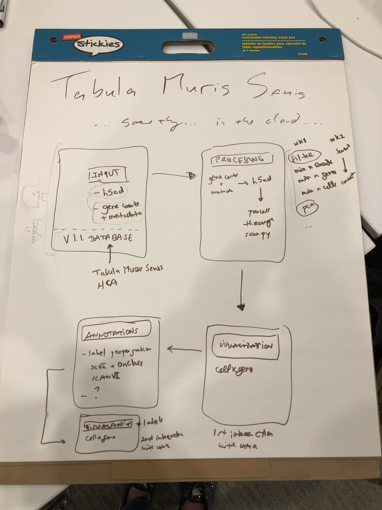

# automated-sc-RNA-seq-analysis-in-the-cloud

The goal of this project is to build a semi-automated sc-RNA-seq analysis workflow in the cloud. Tabula Muris Senis will be used as the reference database for the annotations.

## Where is the data?
- **Tabula Muris**
  - [site](https://tabula-muris.ds.czbiohub.org/)
  - [github](https://github.com/czbiohub/tabula-muris)
  - [data (figshare)](https://figshare.com/projects/Tabula_Muris_Transcriptomic_characterization_of_20_organs_and_tissues_from_Mus_musculus_at_single_cell_resolution/27733)
  - [Single-cell transcriptomics of 20 mouse organs creates a *Tabula Muris* (Nature)](https://www.nature.com/articles/s41586-018-0590-4)
- **Tabula Muris Senis**
  - [site](https://tabula-muris-senis.ds.czbiohub.org/)
  - [github](https://github.com/czbiohub/tabula-muris-senis)
  - [raw data (s3)](https://s3.console.aws.amazon.com/s3/buckets/czb-tabula-muris-senis/)
  - [processed data (figshare)](https://figshare.com/projects/Tabula_Muris_Senis/64982)
  - [A Single Cell Transcriptomic Atlas Characterizes Aging Tissues in the Mouse (BioRxiv)](https://www.biorxiv.org/content/10.1101/661728v2)

