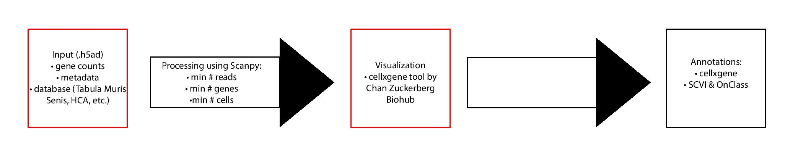

# Automated scRNA-seq Analysis in the Cloud #

## What’s the problem?

Currently, the process of analysing sc-RNA-seq data is difficult to manage without a repertoire of technological skills. There is no singular workflow that guides the user from data inputs to relevant analysis, particularly with a user friendly output.

Utilizing existing tools, we set out to create a linear workflow that would perform basic QC like filtering, normalization and automated annotations. We utilized the existing database Tabula Muris Senis as the starting point for the labelling step but we intend to use other datasets, in particular the ones part of the HCA when they become available.

*Objective*: Build a semi-automated sc-RNA-seq analysis workflow in the cloud that takes raw, unprocessed data and outputs a processed file annotated using **OnClass** and **Tabula Muris Senis** as the reference database for the annotations.

## What is Tabula Muris Senis?

[**Tabula Muris Senis**](https://tabula-muris-senis.ds.czbiohub.org/) is a comprehensive resource for the cell biology community which offers a detailed molecular and cell-type specific portrait of aging.

## What is OnClass?

[**OnClass**](https:///onclass.readthedocs.io/) is a python package for single-cell cell type annotation. It uses the Cell Ontology to capture the cell type similarity and because of that it can label cells in the new dataset whether they are present or not in the training data.

## What's in this repo?

There are three related python projects here:
- In [`webapp`][webapp/] there is simple flask app, that uses the docker containers defined in
- [`context_processing`][context_processing]
- and [`context_annotations`][context_annotations].

To download sample data:
```
./download-data.sh
```

To run the flask app:
```
cd webapp
pip install -r requirements.txt
./start.sh
```

The app uses images we have pushed to dockerhub.
To rebuild the image locally and run it with the samples in `data/`:
```
./build-and-run-image.sh
```

## Roadmap:

This was begun at the Single Cell Hackathon, NYGC, January 15-17, 2020.
It can run in a local development environment, but it's a long way from
being something that could be deployed in the cloud. We've created issues
for some of the next steps.



1. **Input gene counts and metadata .h5ad**  
    1. Preprocessing  
2. **Process data using Scanpy**  
    1. Minimum number of reads  
    2. Minimum number of genes  
    3. Minimum number of cells  
3. **Visualization**  
    1. [Utilizing CZ Biohub cellxgene tool](https://tabula-muris-senis.ds.czbiohub.org/all/scVI-UMAP/)  
4. **Annotations**  
    1. Label Propagation  
    2. SCVI & OnClass

## Dependencies:

[Scanpy]( https://icb-scanpy.readthedocs-hosted.com/en/stable/)
[Docker]( https://www.docker.com/)
[Numpy]( https://numpy.org/)
[IPython]( https://ipython.org/)
[Louvain]( https://pypi.org/project/louvain/)
[Leidenalg]( https://pypi.org/project/leidenalg/)
[python-igraph]( https://igraph.org/python/)
[OnClass](https://pypi.org/project/OnClass/)

## Input file format
.h5ad

  ## Where is the data?
  - **Tabula Muris**
    - [Site](https://tabula-muris.ds.czbiohub.org/)
    - [Github](https://github.com/czbiohub/tabula-muris)
    - [Data (figshare)](https://figshare.com/projects/Tabula_Muris_Transcriptomic_characterization_of_20_organs_and_tissues_from_Mus_musculus_at_single_cell_resolution/27733)
    - [Single-cell transcriptomics of 20 mouse organs creates a *Tabula Muris* (Nature)](https://www.nature.com/articles/s41586-018-0590-4)
  - **Tabula Muris Senis**
    - [Site](https://tabula-muris-senis.ds.czbiohub.org/)
    - [Github](https://github.com/czbiohub/tabula-muris-senis)
    - [Raw data (s3)](https://s3.console.aws.amazon.com/s3/buckets/czb-tabula-muris-senis/)
    - [Processed data (figshare)](https://figshare.com/projects/Tabula_Muris_Senis/64982)
    - [A Single Cell Transcriptomic Atlas Characterizes Aging Tissues in the Mouse (BioRxiv)](https://www.biorxiv.org/content/10.1101/661728v2)

  ## Codeathon team:
**Lead** [Angela Oliveira Pisco, PhD](https://github.com/aopisco) - Chan Zuckerberg Biohub  
[Chuck McCallum](https://github.com/mccalluc) - Harvard Medical School  
[Kyndal Goss](https://github.com/klg11585) – NIH Vaccine Research Center  
[Sanjana Shah](https://github.com/shahsanjana) - NIH Vaccine Research Center  
[Jaqueline Cattell](https://github.com/cattellj) – NIH Office of Data Science Strategy  
